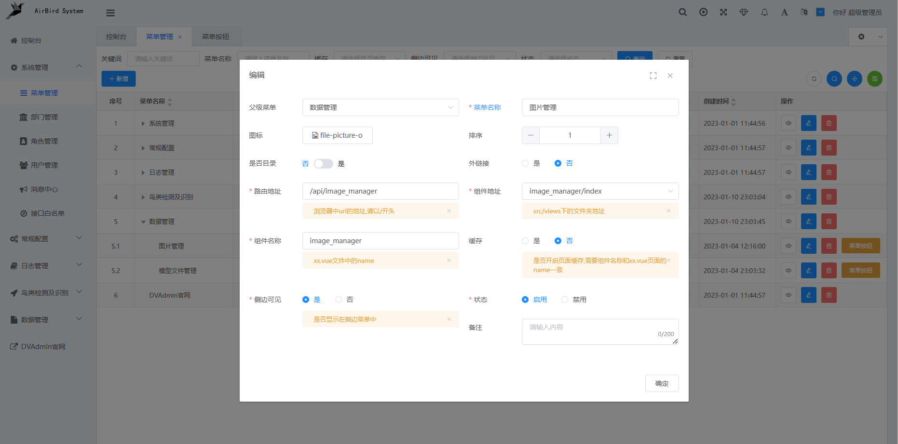
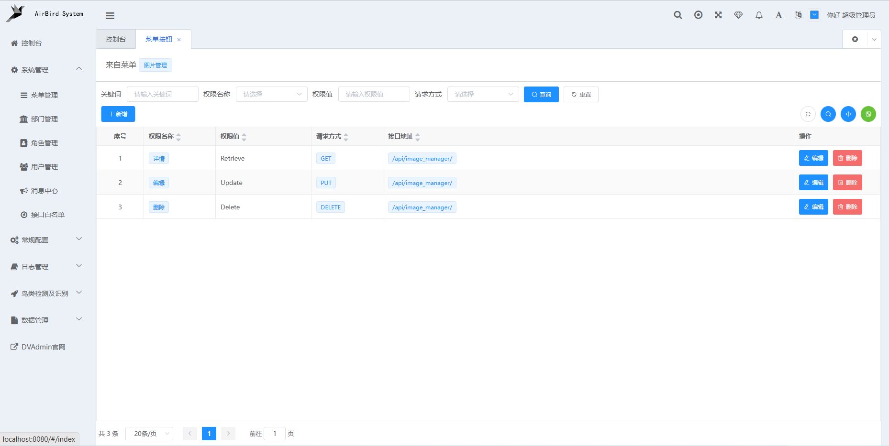
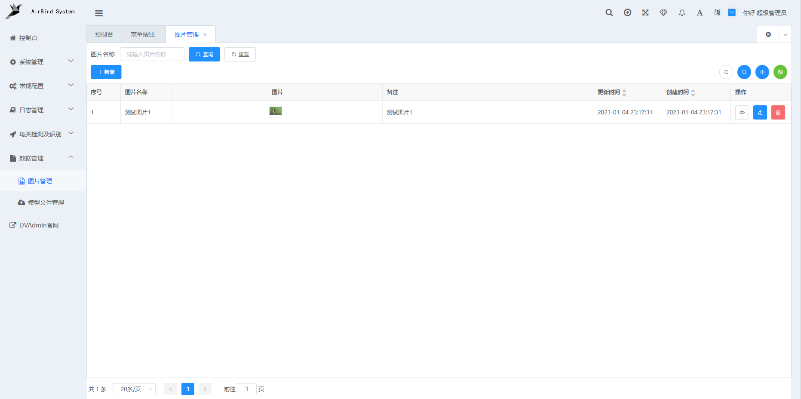
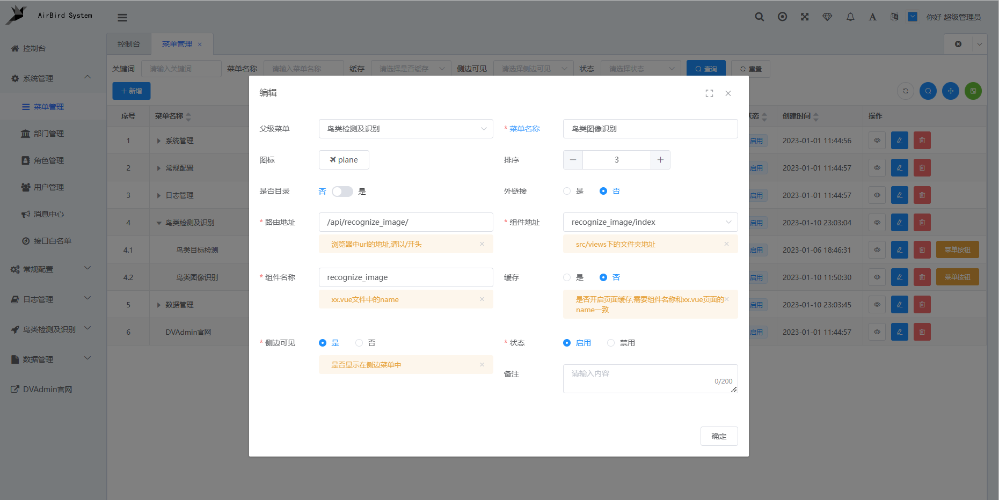
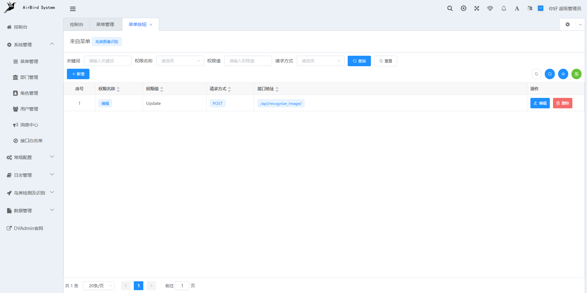
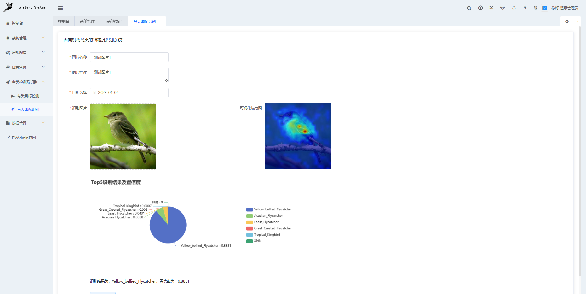

# dvadmin使用说明文档

## 一、 下载及配置

*   下载dvadmin[源码](https://gitee.com/liqianglog/django-vue-admin)
*   下载Nodejs，参考博文：[Nodejs安装教程](https://blog.csdn.net/qq_48485223/article/details/122709354)（第三步之前）
*   下载mysql，参考博文：[下载和安装MySQL(傻瓜)教程](https://blog.csdn.net/weixin_43347550/article/details/105654351)，[MySQL下载安装配置完整教程(详细流程)](https://blog.csdn.net/weixin_46503238/article/details/114440213)(配置环境变量部分)

## 二、 测试运行

### 2.1. 前端部分

*   进入前端目录

```bash
cd web
```

*   安装依赖

```bash
npm install --registry=https://registry.npm.taobao.org
```

*   启动服务

```bash
 npm run dev
```

### 2.2 后端部分（需要配置mysql）

*   CMD环境下配置mysql

```bash
mysql -u root -p
create DATABASE manager;
```

*   进入后端目录

```bash
cd backend
```

*   在项目根目录中，复制 ./conf/env.example.py 文件为一份新的到 ./conf 文件夹下，并重命名为 env.py
*   安装依赖环境

```bash
pip install -r requirements.txt
```

*   在env.py中进行配置

```python
 # 数据库密码
 DATABASE_PASSWORD = "123456" # 与mysql设置相同
 # 数据库名
 DATABASE_ENGINE = "django.db.backends.mysql"
 DATABASE_NAME = "manager" # 与第一步注册名一致
```

*   执行迁移命令

```bash
python manage.py makemigrations
python manage.py migrate
```

*   初始化数据

```bash
python manage.py init
```

*   初始化省市县数据

```bash
python manage.py init_area
```

*   启动项目

```bash
python manage.py runserver 127.0.0.1:8000
```

*   同时启动前端及后端后，访问 127.0.0.1:8080，正常显示登录界面且验证码可用，点击登录后正常进入主页

## 三、 新增图片管理demo
根据官方文档新增一个图片管理demo（其余增删改查应用同理）
### 3.1 后端部分

*   创建名为image\_manager的app

```bash
cd backend
python manage.py startapp image_manager
```

*   在./application/settings.py内添加image\_manager

```python
# Application definition
INSTALLED_APPS = [
    "django.contrib.auth",
    "django.contrib.contenttypes",
    "django.contrib.sessions",
    "django.contrib.messages",
    "django.contrib.staticfiles",
    "django_comment_migrate",
    "rest_framework",
    "django_filters",
    "corsheaders",  # 注册跨域app
    "dvadmin.system",
    "drf_yasg",
    "captcha",
    'channels',
    'image_manager', # 新增的个人app
]
```

*   编写models.py文件

```python
from django.db import models
from dvadmin.utils.models import CoreModel, table_prefix
# Create your models here.

# 用于与mysql建立关系
class Imageuploader(CoreModel):
     
     # mysql内的键名
    name = models.CharField(max_length=100, blank=True, null=True, verbose_name="图片名称", help_text="图片名称")
    image_item = models.TextField(blank=True, null=True, verbose_name="图片内容", help_text="图片内容")  # 图片名称
    
    # 注册mysql
    class Meta:
        db_table = table_prefix + "image_manager"
        verbose_name = "图片管理表"
        verbose_name_plural = verbose_name
        ordering = ('-create_datetime',)
```

*   编写views.py文件

```python
# 基本不需要修改

from image_manager.models import Imageuploader
from dvadmin.utils.serializers import CustomModelSerializer
from dvadmin.utils.viewset import CustomModelViewSet
# Create your views here.
class ImageSerializer(CustomModelSerializer):
    class Meta:
        model = Imageuploader  # 对应models.py内的类名
        fields = "__all__"
        read_only_fields = ["id"]
        
class ImageViewSet(CustomModelViewSet):
    queryset = Imageuploader.objects.all()  # models.py内的类名
    serializer_class = ImageSerializer  # 上面的序列类名
    extra_filter_backends = []
    search_fields = ['label']
```

*   新建urls.py

```python
# 配置路由
from rest_framework.routers import SimpleRouter
from .views import ImageViewSet
router = SimpleRouter()

# api/image_manager为访问接口，ImageViewSet为views.py文件内的视图类名
router.register("api/image_manager", ImageViewSet) 
urlpatterns = [
]
urlpatterns += router.urls
```

*   在./application/urls.py内注册

```python
urlpatterns = (
        [
            re_path(
                r"^swagger(?P<format>\.json|\.yaml)$",
                schema_view.without_ui(cache_timeout=0),
                name="schema-json",
            ),
            path(
                "",
                schema_view.with_ui("swagger", cache_timeout=0),
                name="schema-swagger-ui",
            ),
            path(
                r"redoc/",
                schema_view.with_ui("redoc", cache_timeout=0),
                name="schema-redoc",
            ),
            path("api/system/", include("dvadmin.system.urls")),
            path("api/login/", LoginView.as_view(), name="token_obtain_pair"),
            path("api/logout/", LogoutView.as_view(), name="token_obtain_pair"),
            path("token/refresh/", TokenRefreshView.as_view(), name="token_refresh"),
            re_path(
                r"^api-auth/", include("rest_framework.urls", namespace="rest_framework")
            ),
            path("api/captcha/", CaptchaView.as_view()),
            path("api/init/dictionary/", InitDictionaryViewSet.as_view()),
            path("api/init/settings/", InitSettingsViewSet.as_view()),
            path("apiLogin/", ApiLogin.as_view()),
            path('',include('image_manager.urls')), # 新增的用户app路由
        ]
        + static(settings.MEDIA_URL, document_root=settings.MEDIA_ROOT)
        + static(settings.STATIC_URL, document_root=settings.STATIC_URL)
        + [re_path(ele.get('re_path'), include(ele.get('include'))) for ele in settings.PLUGINS_URL_PATTERNS]
)
```

*   迁徙app

```bash
python manage.py makemigrations image_manager
python manage.py migrate image_manager
```

### 3.2 前端部分

*   在web/src/views下新建后端对应的image\_manager文件夹
*   新建api.js文件

```javascript
// 基本不用修改
import { request } from '@/api/service'
export const urlPrefix = '/api/image_manager/'  //对应后端image_manager/urls文件夹内注册的路由地址
/**
 * 列表查询
 */
export function GetList (query) {
  return request({
    url: urlPrefix,
    method: 'get',
    params: query
  })
}
/**
 * 新增
 */
export function createObj (obj) {
  return request({
    url: urlPrefix,
    method: 'post',
    data: obj
  })
}
/**
 * 修改
 */
export function UpdateObj (obj) {
  return request({
    url: urlPrefix + obj.id + '/',
    method: 'put',
    data: obj
  })
}
/**
 * 删除
 */
export function DelObj (id) {
  return request({
    url: urlPrefix + id + '/',
    method: 'delete',
    data: { id }
  })
}
```

*   新建crud.js文件

```javascript
// 修改columns内容，与后端image_manager内的models.py注册的内容一致
export const crudOptions = (vm) => {
  return {
    pageOptions: {
      compact: true
    },
    options: {
      tableType: 'vxe-table',
      rowKey: true, // 必须设置，true or false
      rowId: 'id',
      height: '100%', // 表格高度100%, 使用toolbar必须设置
      highlightCurrentRow: false
    },
    rowHandle: {
      width: 140,
      view: {
        thin: true,
        text: '',
        disabled () {
          return !vm.hasPermissions('Retrieve')
        }
      },
      edit: {
        thin: true,
        text: '',
        disabled () {
          return !vm.hasPermissions('Update')
        }
      },
      remove: {
        thin: true,
        text: '',
        disabled () {
          return !vm.hasPermissions('Delete')
        }
      }
    },
    indexRow: { // 或者直接传true,不显示title，不居中
      title: '序号',
      align: 'left',
      width: 80
    },
    viewOptions: {
      componentType: 'form'
    },
    formOptions: {
      defaultSpan: 24, // 默认的表单 span
      width: '35%'
    },
    //修改这部分
    columns: [
      {
        title: '图片名称',
        key: 'name',  // 后端注册的名字
        align: 'left',
        width: 120,
        search: {
          disabled: false,
          component: {
            props: {
              clearable: true
            }
          }
        },
        type: 'input',
        form: {
          rules: [ // 表单校验规则
            { required: true, message: '图片名称必填项' }
          ],
          component: {
            props: {
              clearable: true
            },
            placeholder: '请输入图片名称'
          },
          itemProps: {
            class: { yxtInput: true }
          }
        }
      },
      {
        title: '图片',
        key: 'image_item',  //后端注册的名字
        type: 'image-uploader',  // 文件上传的type为file-uploader
        form: {
          component: {
            props: {
              elProps: { // 与el-uploader 配置一致
                multiple: false,
                limit: 1 // 限制1个文件
              },
              sizeLimit: 500 * 1024 // 不能超过限制
            },
            span: 24
          },
          helper: '限制文件大小不能超过500k'
        }
      }
    ].concat(vm.commonEndColumns({
      description: {
        showForm: true,
        showTable: true
      }
    }))
  }
}
```

*   新建index.vue文件

```javascript
// 基本不用修改
<template>
    <d2-container :class="{ 'page-compact': crud.pageOptions.compact }">
      <d2-crud-x
        ref="d2Crud"
        v-bind="_crudProps"
        v-on="_crudListeners"
      >
        <div slot="header">
          <crud-search
            ref="search"
            :options="crud.searchOptions"
            @submit="handleSearch"
          />
          <el-button-group>
            <el-button size="small" type="primary" @click="addRow"
              ><i class="el-icon-plus" /> 新增</el-button
            >
          </el-button-group>
          <crud-toolbar
            :search.sync="crud.searchOptions.show"
            :compact.sync="crud.pageOptions.compact"
            :columns="crud.columns"
            @refresh="doRefresh()"
            @columns-filter-changed="handleColumnsFilterChanged"
          />
        </div>
      </d2-crud-x>
    </d2-container>
  </template>
<script>
import * as api from './api'
import { crudOptions } from './crud'
import { d2CrudPlus } from 'd2-crud-plus'
export default {
  name: 'image_manager',  //修改名称为应用名
  mixins: [d2CrudPlus.crud],
  data () {
    return {
      drawer: false,
      dictionaryRow: {}
    }
  },
  methods: {
    getCrudOptions () {
      return crudOptions(this)
    },
    pageRequest (query) {
      query.is_value = false
      return api.GetList(query)
    },
    addRequest (row) {
      d2CrudPlus.util.dict.clear()
      return api.createObj(row)
    },
    updateRequest (row) {
      d2CrudPlus.util.dict.clear()
      return api.UpdateObj(row)
    },
    delRequest (row) {
      return api.DelObj(row.id)
    }
  }
}
</script>
```

### 3.3 网页操作部分

*   在系统管理/菜单管理下，点击新增，填写相关信息
    <br>
*   点击图片管理右侧的菜单按钮，添加相应的权限
     <br>
*   刷新界面，侧边栏中出现图片管理项。进入并点击新增，产生记录数据
     <br>

### 3.4 备注

*   若前端编译过程中出现未对齐或缺少空格等错误，尝试执行命令

```bash
npm run lint -- --fix
```

*   前后端启动命令分别为

```bash
 npm run dev
 python manage.py runserver 127.0.0.1:8000
```

*   [参考博文1](https://blog.csdn.net/QAZJOU/article/details/126680407)
*   [参考博文2](https://bbs.django-vue-admin.com/article/9.html)
## 四、新增图像识别demo

### 4.1 后端部分

*   创建名为recognize\_image的app

```bash
cd backend
python manage.py startapp recognize_image
```

*   在./application/settings.py内添加recognize\_image

```python
INSTALLED_APPS = [
    "django.contrib.auth",
    "django.contrib.contenttypes",
    "django.contrib.sessions",
    "django.contrib.messages",
    "django.contrib.staticfiles",
    "django_comment_migrate",
    "rest_framework",
    "django_filters",
    "corsheaders",  # 注册跨域app
    "dvadmin.system",
    "drf_yasg",
    "captcha",
    'channels',
    'image_manager',  # 图像管理app
    'recognize_image', # 图像识别app
]
```

*   与上面的增删改查demo不同，不对model.py进行操作，仅识别不与数据库产生交互（实现app间的交互过于复杂，没研究明白hhhh）
*   在views.py内，直接定义函数，通过@require\_http\_methods(\["POST", "GET", "PUT", "DELETE"])定义方法

```python

import os
import sys
import json
from django.conf import settings
from django.http import HttpResponse
from django.views.decorators.csrf import csrf_exempt
from django.views.decorators.http import require_http_methods

sys.path.append('..')
sys.path.append('../recognize_model')  # 特别注意添加识别模型所在路径

from recognize_model.main import ViT
vit = ViT()

# 直接定义http方法
@require_http_methods(["POST", "GET", "PUT", "DELETE"])
@csrf_exempt
def recognize(request):
    if request.method == 'POST':
        file = request.FILES.get("file")  # 获取前端上传的文件
        original_path = "static/images/origin"
        file_path = os.path.join(settings.BASE_DIR, original_path)
        file_name = os.path.join(file_path, file.name)
        f = open(file_name, "wb+")
        for chunk in file.chunks():
            f.write(chunk)
       
        origin_image_path = file_name
        heatmap, label_list, confidence_list = vit.recognize_image(origin_image_path)
        topk_label = []
        topk_confidence = []
        for index in range(len(label_list)):
            topk_label.append(label_list[index])
            topk_confidence.append(str(round(confidence_list[index], 4)))
   
        result_root_path = "static/images/heatmap"
        result_path = os.path.join(settings.BASE_DIR, result_root_path)
        result_name = os.path.join(result_path, file.name)
        heatmap.save(result_name)
        other_confidence = str(round(1 - sum(confidence_list)))
        
        #  返回图片原路径，热力图路径及top5的类别名及置信率
        data = {
            "code":200,
            'msg':"上传图片成功",
            'original_path':original_path,
            'heatmap_path': result_root_path,
            'top1_label': topk_label[0],
            'top1_confidence':topk_confidence[0],
            'top2_label': topk_label[1],
            'top2_confidence':topk_confidence[1],
            'top3_label': topk_label[2],
            'top3_confidence':topk_confidence[2],
            'top4_label': topk_label[3],
            'top4_confidence':topk_confidence[3],
            'top5_label': topk_label[4],
            'top5_confidence':topk_confidence[4],
            'other_label': '其他',
            'other_confidence': other_confidence
        }
        return HttpResponse(json.dumps(data))
```

*   新建urls.py文件，直接定义路由（使用增删改查demo内的register方法会报错）

```python

from django.urls import path
from. import views

# api/recognize_image/为前端访问接口，views.recognize为后端处理函数
urlpatterns = [
    path('api/recognize_image/', views.recognize, name = 'recognize'),
]
```

*   在./application/urls.py内进行注册

```python

urlpatterns = (
        [
            re_path(
                r"^swagger(?P<format>\.json|\.yaml)$",
                schema_view.without_ui(cache_timeout=0),
                name="schema-json",
            ),
            path(
                "",
                schema_view.with_ui("swagger", cache_timeout=0),
                name="schema-swagger-ui",
            ),
            path(
                r"redoc/",
                schema_view.with_ui("redoc", cache_timeout=0),
                name="schema-redoc",
            ),
            path("api/system/", include("dvadmin.system.urls")),
            path("api/login/", LoginView.as_view(), name="token_obtain_pair"),
            path("api/logout/", LogoutView.as_view(), name="token_obtain_pair"),
            path("token/refresh/", TokenRefreshView.as_view(), name="token_refresh"),
            re_path(
                r"^api-auth/", include("rest_framework.urls", namespace="rest_framework")
            ),
            path("api/captcha/", CaptchaView.as_view()),
            path("api/init/dictionary/", InitDictionaryViewSet.as_view()),
            path("api/init/settings/", InitSettingsViewSet.as_view()),
            path("apiLogin/", ApiLogin.as_view()),
            path('',include('image_manager.urls')), # 图片管理app
            path('',include('recognize_image.urls')), # 图像识别app
        ]
        + static(settings.MEDIA_URL, document_root=settings.MEDIA_ROOT)
        + static(settings.STATIC_URL, document_root=settings.STATIC_URL)
        + [re_path(ele.get('re_path'), include(ele.get('include'))) for ele in settings.PLUGINS_URL_PATTERNS]
)
```

*   迁徙app

```bash
python manage.py makemigrations recognize_image
python manage.py migrate recognize_image
```

### 4.2 前端部分

*   在web/src/views下新建后端对应的recognize\_image文件夹
*   与上面的增删改查demo不同，文件夹内直接新建index.vue（无api.js及crud.js）

```javascript

<template>
    <d2-container>
    
    //使用el-card将界面嵌入一个box内，好看一点hhhh
    <el-card class="box-card" >
    <div slot="header" class="clearfix">
      <span>面向机场鸟类的细粒度识别系统</span>
    </div>
    
    // 使用el-col :span定义水平网格，实现左右布局
    <el-col :span="20">
    
      // 定义表单数据
      <el-form :model="ruleForm" :rules="rules" ref="ruleForm" label-width="100px">
        <el-form-item label="图片名称" prop="name" class="input-box">
          <el-input v-model="ruleForm.name" ></el-input>
        </el-form-item>
        <el-form-item label="图片描述" prop="desc" class="input-box">
          <el-input type="textarea" v-model="ruleForm.desc"></el-input>
        </el-form-item>
        <el-form-item label="日期选择" prop="date" class="input-box">
              <el-date-picker v-model="ruleForm.date" format="yyyy-MM-dd" value-format="yyyy-MM-dd"
                :style="{width: '100%'}" placeholder="请选择日期" clearable></el-date-picker>
        </el-form-item>
        <el-row>
        <el-col :span="10">  // 占页面的左半部分
        <el-form-item label="识别图片" prop="original_image">
          <el-upload
              class="avatar-uploader"
              ref="upload"
              :action= "uploadurl()"  // 上传后端的接口地址
              :show-file-list="false"
              :auto-upload="true"
              :on-success="uploadsuccess">  // 点击后直接调用uploadsuccess函数
              // 当存在original_image时，进行展示，初始化没有
            
            <i v-else class="el-icon-plus avatar-uploader-icon"></i>
          </el-upload>
        </el-form-item>
      </el-col>
      <el-col :span="10"> //占页面的右半部分
        <el-form-item v-if ="heat_map" label="可视化热力图">
          
        </el-form-item>
      </el-col>
      </el-row>
      <el-form-item>  // 定义echart图标组件
          <div class="echart" id="mychart" ref="Echarts" :style="myChartStyle"></div>
      </el-form-item>
      <el-form-item v-if ="heat_map">
          <div>识别结果为：{{this.pieData[0].name}}，置信率为：{{this.pieData[0].value}}</div>
      </el-form-item>
     
     // 定义清空按钮
      <el-form-item v-if ="heat_map">
        <el-button @click="resetForm('ruleForm')" type="primary" plain>重置数据</el-button>
      </el-form-item>
      </el-form>
      </el-col>
    </el-card>
    </d2-container>
    </template>
<script>
import * as echarts from 'echarts'
function convertFloat (a) {
  var floatValue = +(a)
  return floatValue
};
export default {
  name: 'recognize_image',
  data () {
    return {
      
      // 表单数据
      ruleForm: {
        name: '',
        desc: '',
        date: ''
      },
      rules: {
        name: [
          { required: true, message: '请输入图片名称', trigger: 'blur' },
          { max: 20, message: '最多20个字符', trigger: 'blur' }
        ],
        desc: [
          { required: true, message: '请填写图片描述', trigger: 'blur' },
          { max: 50, message: '描述最多50个字符', trigger: 'blur' }
        ],
        original_image: [
          { required: true, message: '请上传待识别图片' }
        ],
        date: [
          { required: true, message: '请输入识别日期' }
        ]
      },
      original_image: '', //原始图像地址
      heat_map: '', //热力图地址
      myChart: {}, //echart图表
      pieData: [  //饼图内部数据内容
        {
          value: 0.0, //置信率
          name: ''  //类别名
        },
        {
          value: 0.0,
          name: ''
        },
        {
          value: 0.0,
          name: ''
        },
        {
          value: 0.0,
          name: ''
        },
        {
          value: 0.0,
          name: ''
        },
        {
          value: 0.0,
          name: ''
        }
      ],
      pieName: [],
      myChartStyle: { float: 'left', width: '100%', height: '350px' }
    }
  },
  methods: {
    uploadsuccess (res, files) {
    // 后端传过来的原始图像，热力图地址及置信率与预测类别赋给前端对象
      this.original_image = 'http://127.0.0.1:8000/' + res.original_path + '/' + files.name
      this.heat_map = 'http://127.0.0.1:8000/' + res.heatmap_path + '/' + files.name
      this.pieData[0].name = res.top1_label
      this.pieData[0].value = convertFloat(res.top1_confidence)
      this.pieData[1].name = res.top2_label
      this.pieData[1].value = convertFloat(res.top2_confidence)
      this.pieData[2].name = res.top3_label
      this.pieData[2].value = convertFloat(res.top3_confidence)
      this.pieData[3].name = res.top4_label
      this.pieData[3].value = convertFloat(res.top4_confidence)
      this.pieData[4].name = res.top5_label
      this.pieData[4].value = convertFloat(res.top5_confidence)
      this.pieData[5].name = res.other_label
      this.pieData[5].value = convertFloat(res.other_confidence)
      this.initDate()  //初始化饼图
      this.initEcharts()
    },
    uploadurl () {
      return 'http://127.0.0.1:8000/api/recognize_image/'
    },
    resetForm (formName) {
      this.$refs[formName].resetFields()
      this.original_image = ''
      this.heat_map = ''
      this.myChart.clear()
    },
    initDate () {
      for (let i = 0; i < this.pieData.length; i++) {
        this.pieName[i] = this.pieData[i].name
      }
    },
    initEcharts () {
      // 饼图
      const option = {
        legend: {
          // 图例
          data: this.pieName,
          right: '35%',
          top: '30%',
          orient: 'vertical'
        },
        title: {
          // 设置饼图标题，位置设为顶部居中
          text: 'Top5识别结果及置信度',
          top: '0%',
          left: 'left'
        },
        series: [
          {
            type: 'pie',
            label: {
              show: true,
              formatter: '{b} : {c}'
            },
            radius: '40%', // 饼图半径
            center:['25%', '50%'],
            data: this.pieData
          }
        ]
      }
     
      this.myChart = echarts.init(this.$refs.Echarts)
      this.myChart.setOption(option)
    }
  }
}
// 样式数据
</script>
    <style>
    .avatar-uploader .el-upload {
    border: 1px dashed #d9d9d9;
    border-radius: 6px;
    cursor: pointer;
    position: relative;
    overflow: hidden;
    }
    .avatar-uploader .el-upload:hover {
    border-color: #409EFF;
    }
    .avatar-uploader-icon {
    font-size: 28px;
    color: #8c939d;
    width: 178px;
    height: 178px;
    line-height: 178px;
    text-align: center;
    }
    .avatar {
    width: 250px;
    height: 250px;
    display: block;
    }
    .input-box{
      width:400px;
    }
    </style>
```

*   4.3网页操作部分

*   在系统管理/菜单管理下，点击新增，填写相关信息
    <br>
*   点击右侧的菜单按钮，添加相应的权限
    <br>

*   刷新界面，侧边栏中出现图片识别项
    <br>

## 五、其余改动

*   修改登录界面样式：修改web/src/system/login下文件（主要替换两张图）
*   修改网站名称：全局搜索 “企业级管理系统”，将其替换为需要的名字

